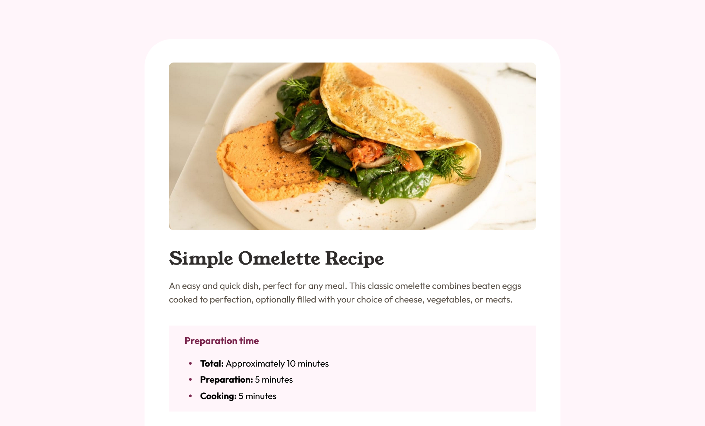

# Recipe Page

This is a solution to the [Recipe page challenge on Frontend Mentor](https://www.frontendmentor.io/challenges/recipe-page-KiTsR8QQKm).

## Table of contents

- [Recipe Page](#recipe-page)
  - [Table of contents](#table-of-contents)
  - [Overview](#overview)
    - [Built with](#built-with)
    - [Continued development](#continued-development)

## Overview

| You can see my site here: [Recipe Page URL](https://crisscde.github.io/frontend-mentor-challenges/recipe-page/)

### Built with

- Semantic HTML5 markup
- CSS custom properties
- Mobile-first workflow
- @Font-face() rule

### Continued development
I wanna search more about ***CSS architectures***, in this project I use BEM, but I wanna know more architectures and can use them in my future projects.
